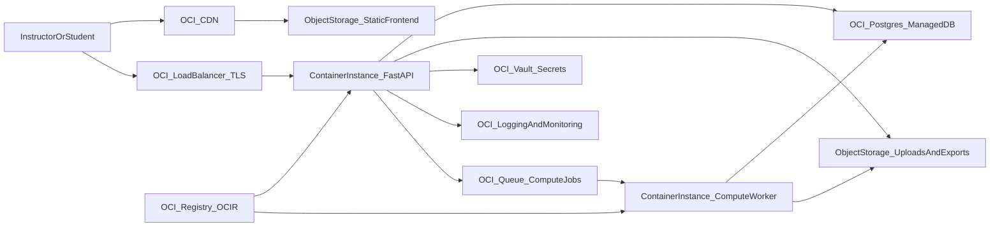

# PreReq

AI-powered concept readiness analysis platform for instructors and students.

<video src="https://raw.githubusercontent.com/ayushmk7/PreReq/master/PreReqDemo.mov" controls width="100%">
  Your browser does not support the video tag. [Download the demo](PreReqDemo.mov).
</video>

## Quick Start

### Prerequisites

- Python 3.11+
- Node.js 18+ / pnpm
- PostgreSQL database (or Neon serverless)
- OpenAI API key (for AI / chat features)

### Backend Setup

```bash
cd backend
cp .env.example .env
# Edit .env with your DATABASE_URL and OPENAI_API_KEY

pip install -r requirements.txt
alembic upgrade head
uvicorn app.main:app --reload
```

Backend runs at `http://localhost:8000`. API docs at `/docs`.

### Frontend Setup

```bash
cd frontend
cp .env.example .env
# Edit .env if backend is not on localhost:8000

pnpm install
pnpm dev
```

Frontend runs at `http://localhost:5173`.

### Environment Variables

#### Backend (`backend/.env`)

| Variable | Required | Default | Description |
|---|---|---|---|
| `DATABASE_URL` | Yes | — | PostgreSQL connection string |
| `OPENAI_API_KEY` | Yes (for AI) | `""` | OpenAI API key |
| `OPENAI_MODEL` | No | `gpt-4o` | Model name |
| `OPENAI_TIMEOUT_SECONDS` | No | `30` | Request timeout |
| `OPENAI_MAX_RETRIES` | No | `2` | Retry count |
| `INSTRUCTOR_USERNAME` | No | `admin` | Basic Auth username |
| `INSTRUCTOR_PASSWORD` | No | `admin` | Basic Auth password |
| `STUDENT_TOKEN_EXPIRY_DAYS` | No | `30` | Token validity |
| `EXPORT_DIR` | No | `/tmp/conceptlens_exports` | Export output path |

#### Frontend (`frontend/.env`)

| Variable | Required | Default | Description |
|---|---|---|---|
| `VITE_API_BASE_URL` | No | `http://localhost:8000` | Backend API URL |
| `VITE_INSTRUCTOR_USERNAME` | No | `""` | Pre-fill login username |
| `VITE_INSTRUCTOR_PASSWORD` | No | `""` | Pre-fill login password |
| `VITE_INSTRUCTOR_NAME` | No | `""` | Instructor name shown on Student Report |
| `VITE_INSTRUCTOR_EMAIL` | No | `""` | Instructor contact email shown on Student Report |
| `VITE_INSTRUCTOR_PHONE` | No | `""` | Instructor contact phone shown on Student Report |
| `VITE_INSTRUCTOR_OFFICE` | No | `""` | Instructor office/location shown on Student Report |
| `VITE_INSTRUCTOR_HOURS` | No | `""` | Instructor office hours shown on Student Report |
| `VITE_TA_NAME` | No | `""` | TA name shown on Student Report |
| `VITE_TA_EMAIL` | No | `""` | TA contact email shown on Student Report |
| `VITE_TA_PHONE` | No | `""` | TA contact phone shown on Student Report |
| `VITE_TA_OFFICE` | No | `""` | TA office/location shown on Student Report |
| `VITE_TA_HOURS` | No | `""` | TA office hours shown on Student Report |

## Architecture

```
frontend/          React + Vite + Tailwind
  app/
    services/      Typed API client + service modules
    pages/         UploadWizard, Dashboard, Trace, StudentReport
    components/    Reusable UI components (DAG, Heatmap, etc.)
    constants/     Placeholder definitions

backend/           FastAPI + SQLAlchemy + Alembic
  app/
    routers/       REST endpoints
    services/      Business logic
    models/        ORM models
    schemas/       Pydantic request/response models
```

## OCI Deployment (Manual, No CI/CD)

This section describes a deep OCI deployment path for this repository using manual runbooks and OCI CLI/Console operations.

### OCI Prerequisites

- OCI account with credits enabled and one primary region selected
- OCI CLI installed and authenticated (`oci setup config`)
- Permissions to create:
  - Compartments, IAM policies/groups
  - VCN/subnets/NSGs/load balancer
  - Vault and secrets
  - PostgreSQL managed database
  - Object Storage buckets and lifecycle rules
  - Container Registry (OCIR), Container Instances, Queue, Logging, Monitoring
- Local tools:
  - Python 3.11+, Node.js 18+, `pnpm`
  - Docker compatible build engine for container images

### Recommended OCI Architecture



### OCI Environment Mapping

#### Backend runtime settings (set via Vault/secret references)

| App Variable | OCI Source |
|---|---|
| `DATABASE_URL` | Vault secret containing OCI PostgreSQL connection string |
| `OPENAI_API_KEY` | Vault secret |
| `OPENAI_MODEL` | Container env var (or Vault secret for consistency) |
| `OPENAI_TIMEOUT_SECONDS` | Container env var |
| `OPENAI_MAX_RETRIES` | Container env var |
| `INSTRUCTOR_USERNAME` | Vault secret |
| `INSTRUCTOR_PASSWORD` | Vault secret |
| `STUDENT_TOKEN_EXPIRY_DAYS` | Container env var |
| `EXPORT_DIR` | Mount path or writable directory in container (`/tmp/conceptlens_exports`) |

#### Frontend settings

| Variable | Value in OCI |
|---|---|
| `VITE_API_BASE_URL` | Public HTTPS API URL behind OCI Load Balancer |
| `VITE_INSTRUCTOR_USERNAME` | Optional, usually blank in production |
| `VITE_INSTRUCTOR_PASSWORD` | Optional, usually blank in production |

### Deployment Order

1. **Foundation**
   - Create compartments (`dev`, `stage`, `prod`) and IAM groups/policies.
   - Create VCN, public/private subnets, NSGs, and route tables.
2. **Security**
   - Create Vault and required secrets.
   - Configure certificate and DNS for HTTPS endpoint.
3. **Data**
   - Provision OCI PostgreSQL.
   - Run `alembic upgrade head` from `backend/`.
   - Create Object Storage buckets (`frontend-static`, `uploads`, `exports`, `backups`).
4. **Runtime**
   - Build and push API/worker images to OCIR.
   - Deploy API and worker on Container Instances.
   - Configure queue and worker permissions.
5. **Frontend**
   - Build frontend and upload static assets to Object Storage.
   - Enable CDN and point DNS.
6. **Validation**
   - Run smoke tests for full workflow and confirm alarms are active.

### Manual Deployment Validation Checklist

- `GET /health` reports healthy database and expected AI key status.
- `GET /docs` is reachable behind TLS.
- Upload flow works: scores CSV, mapping CSV, and graph upload.
- Compute flow works and returns a successful run.
- Instructor dashboard and student report pages render with live API data.
- Logs are visible in OCI Logging with correlation IDs.
- Alarms exist for 5xx error spikes, p95 latency, and DB connectivity failures.

### Day-1 OCI Actions (Use Credits Efficiently)

- Start with one environment (`dev`) and small compute shapes.
- Provision PostgreSQL and Object Storage first; they unlock most app features.
- Deploy API container before worker to validate baseline path quickly.
- Publish frontend through Object Storage + CDN after API endpoint is stable.
- Add lifecycle rules and alerting immediately to avoid silent credit burn.

See detailed OCI runbooks in `docs/oci/`.
