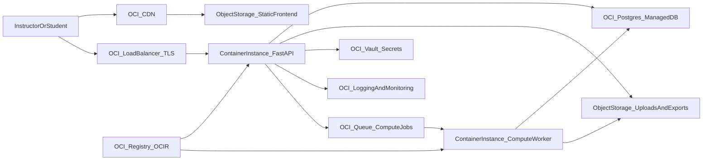

# PreReq OCI Target Architecture

This document defines the target OCI deployment for the project with a budget-aware rollout.

## High-Level Architecture

## Network Topology

- Public subnet: Load Balancer and CDN entry points
- Private app subnet: API and worker containers
- Private data subnet: PostgreSQL

Traffic policy:
- Internet access only via HTTPS through Load Balancer/CDN
- No direct public access to API containers or DB
- API/worker egress only to DB, queue, object storage, vault, and logging endpoints

## Core Services

- **Frontend**: Static assets in Object Storage + CDN
- **Backend API**: FastAPI in Container Instances
- **Compute Worker**: Queue-driven background compute in Container Instances
- **Database**: OCI PostgreSQL
- **Storage**: Object Storage for uploads, exports, and backups
- **Secrets**: OCI Vault
- **Registry**: OCIR for image hosting
- **Observability**: OCI Logging/Monitoring/Alarms

## Budget-Aware Defaults

- Deploy `dev` environment first
- Use small compute shapes and one worker replica
- Add budget alarms at 50/75/90%
- Enable object lifecycle policies on day 1
